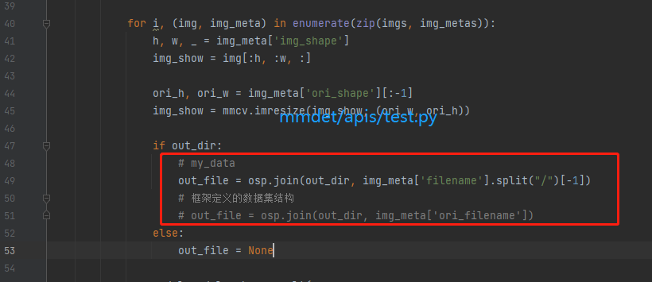
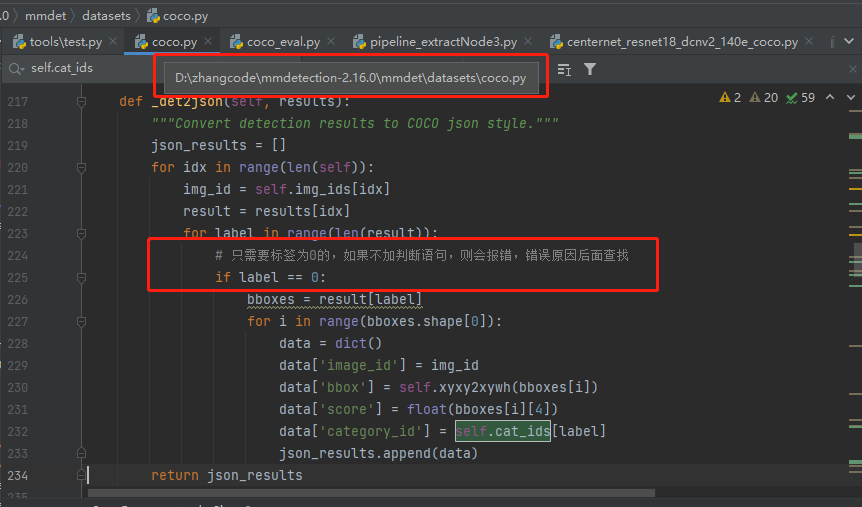

## 每次修改mmdetection文件都需要更新

```python
python setup.py install
```


## 1. 训练

**1.指令**

```python
CUDA_VISIBLE_DEVICES=2,3,7 python -m torch.distributed.launch --nproc_per_node 3 tools/train.py configs/a_thyroid/centernet_resnet18_140e_coco_thyroid.py --work-dir runs/centernet_resnet18_140e_coco_thyroid.py/ --gpu-ids 2 3 7 --launcher pytorch

```

**2.需要修改的地方**


## 2. 测试保存推理过的图片

**1. 指令**

```python
CUDA_VISIBLE_DEVICES=1 python tools/test.py configs/a_thyroid/centernet_resnet18_140e_coco_thyroid.py ./runs/centernet_resnet18_140e_coco_thyroid.py/epoch_25.pth --show-dir results
```

**2. 需要修改的地方**




## 3. 测试保存json

**1. 指令**

```python
CUDA_VISIBLE_DEVICES=2,3,7 python -m torch.distributed.launch --nproc_per_node=3 tools/test.py --config configs/a_thyroid/centernet_resnet18_140e_coco_thyroid.py --checkpoint ./runs/centernet_resnet18_140e_coco_thyroid.py/epoch_25.pth --format-only --options "jsonfile_prefix=./centernet_resnet18_140e_coco_thyroid" 
```

**2. 需要修改的地方**




## 4. 计算指标mAP等

**1.指令**

```python
python  tools/test.py configs/a_thyroid/centernet_resnet18_140e_coco_thyroid.py ./runs/centernet_resnet18_140e_coco_thyroid.py/epoch_25.pth --eval bbox
```


## 5. results

|            Model             | Methods | Results                                                      | remarks |
| :--------------------------: | ------- | ------------------------------------------------------------ | ------- |
| centernet_resnet18_140e_coco | -       | **Image  level metric:** F1: 0.558, TP: 84, FP: 32, FN: 101  **Nodule  level metric:** conf: 0.412, FP: 19, precision: 0.500,  recall: 0.760, F1: 0.603, Absence nodule:[0, 1, 5, 11, 15, 23] |         |
|                              |         |                                                              |         |
|                              |         |                                                              |         |

